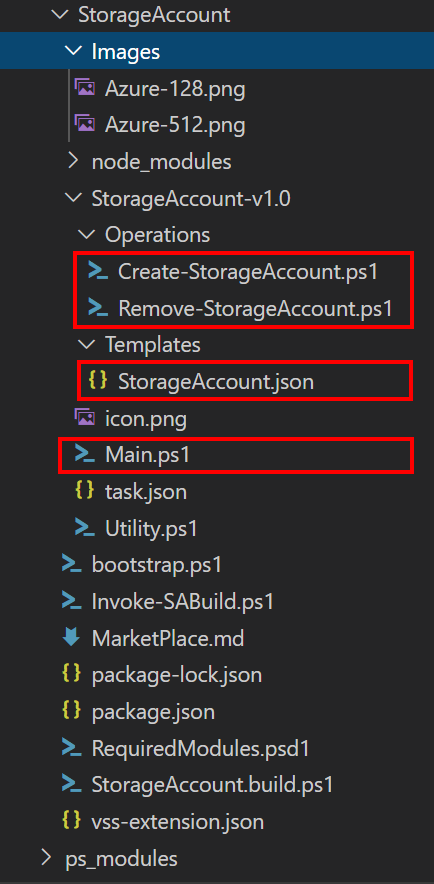
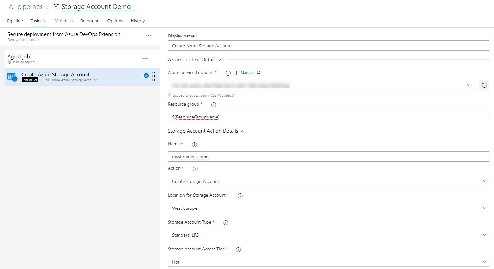
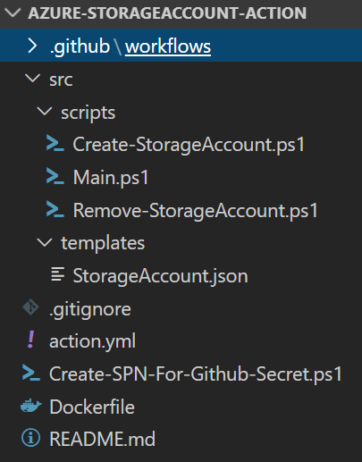
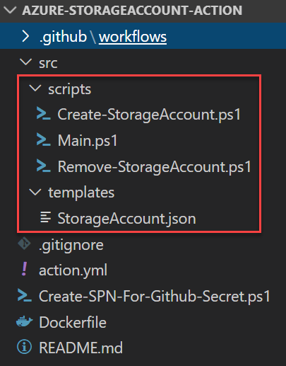

---
layout: post
title: Comparing Azure DevOps Extension Pipeline tasks with Github Actions
categories: [CI/CD]
tags: [CI/CD]
comments: true
---

In my [last blog post](https://stefanstranger.github.io/2020/02/28/PlayingWithGitHubActions/) I shared my first experiences with Github Actions. One of the features of Github Actions is that you can publish actions in GitHub Marketplace and share actions you've created with the GitHub community.

After having developed quite some Azure DevOps (Release) Extensions I wanted to learn how to develop custom Github Actions and compare them.

Let's first start with a short intro into Azure DevOps Extensions for those who are unaware of this feature.

# Azure DevOps Extensions

Extensions are simple add-ons that can be used to customize and extend your DevOps experience with Azure DevOps Services. They are written with standard technologies - HTML, JavaScript, CSS - and can be developed using your preferred development tools.

Extensions can have multiple CI/CD Azure Pipelines tasks.

## Advantages of Extension

Some of the advantages of using Azure DevOps Exensions are:

* Easy consumable by DevOps teams
* Available via a (Private) MarketPlace
* Supports versioning of both Extension and Tasks within Extension

Most of the Extensions with Azure Pipeline tasks I've developed where private Extensions to deploy 'certified' Azure Resources/Products which could be consumed by DevOps teams within the customer DevOps organization. Within these Extensions ARM templates and PowerShell scripts are used to deploy the 'certified' Azure Resources/Products.

With 'cerfified' Azure Products customers can embed security and/or service management controls into their to be consumed Azure Products. An example of a security control that could be added to a 'certified' Azure Storage Account product could be that *[all data needs to be encrypted in transit over public and private interconnections](https://docs.microsoft.com/en-us/azure/storage/common/storage-require-secure-transfer)*.

For the *Azure Storage Account*  this would mean that the Secure transfer setting of the Storage Accounts needs to be enabled for all Storage Accounts to be deployed by DevOps teams in their pipelines. This setting can be configured in the ARM template used to deploy the Storage Account.

If you want to learn more about how to develop an Azure DevOps Extension you can also view the recording of my PowerShell Conference Europe session called ["Extend your PowerShell skills by creating Azure DevOps Extensions"](https://www.youtube.com/watch?v=2lFgytAJ5hU)

## Azure DevOps Storage Account Extension

The Storage Account Extension with Azure Pipeline tasks is build with PowerShell scripts and an ARM Template.



The Storage Account is deployed using the Create-StorageAccount.ps1 PowerShell script and the ARM StorageAccount.json file.

To remove the Storage Account the Remove-StorageAccount.ps1 script is used. The Main.ps1 PowerShell script translates the input from the Azure DevOps Extension task and calls the Create or Remove Storage Accounts PowerShell scripts.

The rest of the artifacts are used to build and publish the Azure DevOps Extension.

Within an Azure DevOps Release the following Extension Task parameters can be  configured as input:



In a YAML pipeline it looks as follows:

```yaml
steps:
- task: Demo-StorageAccount@0
  displayName: 'Azure Storage Account on $(ResourceGroupName)'
  inputs:
    azureSubscription: 'Demo Azure Subscription'
    StorageAccountName: mystorageaccount
    AccountType: 'Standard_LRS'
    AccessTier: Hot
```

In the next part of this blog post I want to create the same functionality, to deploy and remove an Azure Storage Account using Github Actions in a Github Workflow.

### Functionality Github Actions:

In the Github Action I want to implement the following functionality.

1. Deploy an Azure Storage Account using an ARM Template with the following parameters:

* Resource Group name
* Storage Account name
* Location
* Storage Account type (allowed values: "Standard_LRS", "Standard_GRS", "Standard_RAGRS", "Standard_ZRS")
* Storage Account Access Tier (allowed values: "Hot","Cool")

2. Github Action(s) only consumable by authorized Github Environments (simular to Private Visual Studio Marketplace)

3. Support for versioning

## Github Storage Account Action

The Github Storage Account Action is build using a [Docker container](https://help.github.com/en/actions/building-actions/creating-a-docker-container-action). The reason for me using a Docker container to build the Github Action is the reusability of the code I already used for the Azure DevOps Storage Account Extension and tasks. 

Currently Github Actions supports the following options to [build Github Actions](https://help.github.com/en/actions/building-actions):
* [Docker container](https://help.github.com/en/actions/building-actions/creating-a-docker-container-action)
* [Javascript](https://help.github.com/en/actions/building-actions/creating-a-javascript-action)

### Steps to create a Docker container Action

1. Create Github Repository
1. Create a Dockerfile
1. Create an action metadata file
1. Write action code
1. Create a README
1. Commit, tag and push action to Github
1. Testing action in workflow

Skipping describing step 1 because you can easily find information online on how to [create a new repository](https://help.github.com/en/articles/creating-a-new-repository).



**Step 2. Create a Dockerfile**

In your new storageaccount directory, create a new Dockerfile file.

***Dockerfile***

```docker
FROM mcr.microsoft.com/powershell:7.0.0-rc.3-alpine-3.8
RUN pwsh -c "Install-Module Az.Accounts -Scope AllUsers -Acceptlicense -Force"
RUN pwsh -c "Install-Module Az.Profile -Scope AllUsers -Acceptlicense -Force"
RUN pwsh -c "Install-Module Az.Resources -Scope AllUsers -Acceptlicense -Force"
RUN pwsh -c "Install-Module Az.Storage -Scope AllUsers -Acceptlicense -Force"
COPY ./src/ ./tmp/
ENTRYPOINT ["pwsh","-File","/tmp/scripts/Main.ps1"]
```

Let's go through the Dockerfile step by step.

|FROM mcr.microsoft.com/powershell:7.0.0-rc.3-alpine-3.8|
|----------|

The [FROM instruction](https://docs.docker.com/engine/reference/builder/#from) initializes a new build stage and sets the Base Image for subsequent instructions.
We need PowerShell (core) to run the PowerShell command to deploy and remove the Storage Account, so we will be using the currently latest available alpine version.

| RUN pwsh -c "Install-Module Az.xxx -Acceptlicense -Force" |
|----------|

The Docker file needs to be able to run PowerShell scripts containing the following Azure PowerShell commands:

* Connect-AzAccount (to connect to Azure)
* New-AzResourceGroupDeployment (to deploy Storage Account with ARM Template)
* Get-AzStorageAccount (get Storage Account to validate if it exists before removing)
* Remove-AzStorageAccount (to remove Storage Account)

For above commands it's necessary to install the following Azure PowerShell modules available in the Docker container:

* Az.Accounts
* Az.Profile
* Az.Resources
* Az.Storage

| COPY ./src/ ./tmp/ |
|----------|

The [COPY instruction](https://docs.docker.com/engine/reference/builder/#copy) copies new files or directories from <src> and adds them to the filesystem of the container at the path

We need this Docker file instruction to copy the ARM template and PowerShell script files to the container.




| ENTRYPOINT ["pwsh","-File","/tmp/scripts/Main.ps1"] |
|----------|

An [ENTRYPOINT](https://docs.docker.com/engine/reference/builder/#entrypoint) allows you to configure a container that will run as an executable.

In the last step of the Docker container file we want to run a PowerShell script which parses the arguments when starting the Docker container and handles the logic to deploy or remove the Storage Account.


**Step 3.Create an action metadata file**

Docker and JavaScript actions require a metadata file. The metadata filename must be either action.yml or action.yaml. The data in the metadata file defines the inputs, outputs and main entrypoint for your action.

```yaml
# action.yml
name: "GitHub Action for Storage Account"
author: "Stefan Stranger"
description: "Deploys or removes Approved Azure Storage Account."
inputs:
  action: # createStorageAccount or removeStorageAccount
    description: "Name of the Action"
    required: true
    default: createStorageAccount
  ServiceConnection: # Service Connection. Github Action Secret to login to Azure
    description: "Name of Github Action environment variable"
    required: true
  ResourceGroupName:
    description: "Name of ResourceGroup where to deploy or remove the Storage Account"
    required: true
  Location: #Location where to deploy the Storage Account
    description: "Location where the Storage Account will be deployed"
    required: false
  AccountType: # Storage Account Type. Allowed values: "Standard_LRS", "Standard_GRS", "Standard_RAGRS", "Standard_ZRS"
    description: "Name of ResourceGroup where to deploy or remove the Storage Account"
    required: false
    default: Standard_LRS
  AccesTier: # Storage Account Access Tier. Allowed values: "Hot", "Cool"
    description: "Access Tier for the Storage Account"
    required: false
runs:
  using: "docker"
  image: "Dockerfile"
  args: # '"-action" "createStorageAccount" "-StorageAccountName" "githubactiondemosa" "-ResourceGroupName" "ghactiondemo-rg" "-Location" "westeurope" "-AccountType" "Standard_LRS" "-AccessTier" "Cool" "-ServiceConnection" "SERVICECONNECTION"'
    - -action
    - ${{inputs.action}}
    - -StorageAccountName
    - ${{inputs.StorageAccountName}}
    - -ServiceConnection
    - ${{inputs.ServiceConnection}}
    - -ResourceGroupName
    - ${{inputs.ResourceGroupName}}
    - -Location
    - ${{inputs.Location}}
    - -AccountType
    - ${{inputs.AccountType}}
    - -AccessTier
    - ${{inputs.AccessTier}}
```

| inputs |
|----------|

With the inputs statement in the action.yml meta datafile we offer the users of the Github Action to input the required parameter values for the Main.ps1 script.

I choose to incorporate both the deployment and removal of a Storage Account in one Github Action, so some of the inputs are required while others a action specific. 

| args |
|----------|

To allow the Main.ps1 script to consume the input from the Docker Container I had to use arguments. 

It took quite some time to figure out how to supply parameter input from a Docker Container to a Powershell script running within that container, but this is what made it work. If there are better or easier ways please let me know via the comments below this blog post.

The end result is that the arguments are passed on through the Main.ps1 script the followin way:

```bat
"-action" "createStorageAccount" "-StorageAccountName" "githubactiondemosa" "-ServiceConnection" "SERVICECONNECTION" "-ResourceGroupName" "ghactiondemo-rg" "-Location" "westeurope" "-AccountType" "Standard_LRS" "-AccessTier" "Cool"
```

**Step 4. Write action code**

The main reason why I choose to use a Docker image for the Github Action is that you can use any language for my actions, including PowerShell.

The deployment of the Storage Account will be done with the Azure PowerShell cmdlet New-AzResourceGroupDeployment and the supplied ARM Template.

**Create-StorageAccount.ps1**

```PowerShell
#
#.SYNOPSIS
#	Creates Storage Account.

#.DESCRIPTION
#	Creates the given Storage Account
#

Param( 
    [string]$ResourceGroupName,
    [string]$StorageAccountName,
    [string]$Location,
    [string]$AccountType,
    [string]$AccessTier
) 

$ErrorActionPreference = "Stop" 

# Get reference to the ARM template
Write-Verbose -Message 'Get template to Storage Account'
$templateFile = [System.IO.Path]::GetFullPath([System.IO.Path]::Combine($PSScriptRoot, "..\.\templates\StorageAccount.json"))


# Create parameters object for ARM template
$parametersARM = @{ }
$parametersARM.Add("storageAccountName", $StorageAccountName)
$parametersARM.Add("location", $Location)
$parametersARM.Add("accountType", $AccountType)
$parametersARM.Add("accessTier", $AccessTier)

# Deploy with ARM
Write-Verbose 'Deploy ARM template'
$DeploymentName

New-AzResourceGroupDeployment -Name ((Get-ChildItem $templateFile).BaseName + '-' + ((Get-Date).ToUniversalTime()).ToString('MMdd-HHmm')) `
    -ResourceGroupName $ResourceGroupName `
    -TemplateFile $TemplateFile `
    -TemplateParameterObject $parametersARM `
    -Force `
    -Verbose `
    -ErrorVariable ErrorMessages `
    -ErrorAction SilentlyContinue

Write-Verbose "Deployed ARM template, checking for errors..." 
if ($ErrorMessages) {
    $wholeError = @(@($ErrorMessages) | ForEach-Object { $_.Exception.Message.TrimEnd("`r`n") })
    throw $wholeError
}
```

For the orchestration of the deployment or deletion of the Storage Account we are using below Main.ps1 PowerShell script.

**Main.ps1**

```PowerShell
<#
    Script that retrieves input from Github Actions input
#>

Param( 
    [string]$Action,
    [string]$ServiceConnection = "SERVICECONNECTION",
    [string]$ResourceGroupName,
    [string]$StorageAccountName,
    [string]$Location,
    [string]$AccountType,
    [string]$AccessTier
) 

#region Verbose Output for input fields
Write-Output -InputObject ('Input fields are:')
Write-Output -InputObject ('Action: {0}' -f $Action)
Write-Output -InputObject ('StorageAccountName:  {0}' -f $StorageAccountName)
Write-Output -InputObject ('ResourceGroupName: {0}' -f $resourceGroupName)
Write-Output -InputObject ('ServiceConnection: {0}' -f $ServiceConnection)
#endregion

#region retrieve ServiceConnection Secret via Environment Variable
Write-Output -InputObject ('Retrieving Environment variable info')
$Credential = [Environment]::GetEnvironmentVariable($ServiceConnection) | ConvertFrom-Json
#endregion

#region authenticate with Azure Subscription
$azureAppId = $($Credential.clientid)
$azureAppSecret = ConvertTo-SecureString $($Credential.clientSecret) -AsPlainText -Force
$azureAppCred = (New-Object System.Management.Automation.PSCredential $azureAppId, $azureAppSecret )
$subscriptionId = $($Credential.subscriptionId)
$tenantId = $($Credential.tenantId)
Connect-AzAccount -ServicePrincipal -SubscriptionId $subscriptionId -TenantId $tenantId -Credential $azureAppCred
#endregion

#region Execute selected Action
switch ($action) {
    "createStorageAccount" {
        Write-Output -InputObject 'Create Storage Account'
        Write-Output -InputObject ('Location: {0}' -f $Location)
        Write-Output -InputObject ('AccountType: {0}' -f $AccountType)
        Write-Output -InputObject ('AccessTier: {0}' -f $AccessTier)
        #region deploy Storage Account
        $params = @{
            'StorageAccountName' = $StorageAccountName
            'ResourceGroupName'  = $ResourceGroupName
            'Location'           = $Location
            'AccountType'        = $AccountType
            'AccessTier'         = $AccessTier
        }
        \tmp\scripts\Create-StorageAccount.ps1 @params
        #endregion
    }
    "removeStorageAccount" {
        Write-Output -InputObject 'Remove Storage Account'
        Write-Output -InputObject ('Storage Account Name: {0}' -f $StorageAccountName)
        Write-Output -InputObject ('Resource Group Name: {0}' -f $ResourceGroupName)
        #region Remove Storage Account
        $params = @{
            'StorageAccountName' = $StorageAccountName
            'ResourceGroupName'  = $ResourceGroupName
        }
        \tmp\scripts\Remove-StorageAccount.ps1 @params
        #endregion
    }
    default {
        throw 'Unknow action'
    }
}
```

**Configure Azure credentials**

The Github Action needs credentials required to authenticate with Azure. With the following [command](https://docs.microsoft.com/en-us/powershell/azure/azurerm/create-azure-service-principal-azureps?view=azurermps-6.13.0) we can create an Azure Service Principal (SPN) with Contributor permissions on the Subscription level.

```PowerShell
#region Login to Azure
Add-AzAccount
#endregion
 
#region Select Azure Subscription
$subscription = 
(Get-AzSubscription |
    Out-GridView `
        -Title 'Select an Azure Subscription ...' `
        -PassThru)
 
Set-AzContext -SubscriptionId $subscription.subscriptionId -TenantId $subscription.TenantID
#endregion

#region create SPN with Password
$PlainPassword = "[enter password]"
$Password = ConvertTo-SecureString $PlainPassword  -AsPlainText -Force
New-AzADApplication -DisplayName "[enter displayname]" -HomePage "[enter a homepage]" -IdentifierUris "[enter a Identifier url]" -Password $Password -OutVariable app
New-AzADServicePrincipal -ApplicationId $app.ApplicationId
New-AzRoleAssignment -RoleDefinitionName Contributor -ServicePrincipalName $app.ApplicationId.Guid

Get-AzADApplication -DisplayNameStartWith '[enter name of AD Application from earlier step]' -OutVariable app
Get-AzADServicePrincipal -ServicePrincipalName $app.ApplicationId.Guid -OutVariable SPN
#endregion

#region output info
[ordered]@{
    "clientId"       = "$($app.ApplicationId)"
    "clientSecret"   = "$PlainPassword"
    "subscriptionId" = "$($subscription.subscriptionId)"
    "tenantId"       = "$($subscription.TenantID)"
} | Convertto-json -Compress
#endregion

```

The Service Principal properties need to be configured as a [Github Action Secret with the name AZURE_CREDENTIALS (or any other name you want it to be) in the Github Repository](https://github.com/Azure/actions-workflow-samples/blob/master/assets/create-secrets-for-GitHub-workflows.md).


The properties of the AZURE_CREDENTIALS Github Secret will be used in the final Github Workflow as an environment variable.

```yaml
    env: # Github Secret stored as Environment variable
      SERVICECONNECTION: ${{ secrets.AZURE_CREDENTIALS}}
```

In the Main.ps1 PowerShell script this Environment variable is used to authenticate to Azure.

```PowerShell
#region retrieve ServiceConnection Secret via Environment Variable
Write-Output -InputObject ('Retrieving Environment variable info')
$Credential = [Environment]::GetEnvironmentVariable($ServiceConnection) | ConvertFrom-Json
#endregion

#region authenticate with Azure Subscription
$azureAppId = $($Credential.clientid)
$azureAppSecret = ConvertTo-SecureString $($Credential.clientSecret) -AsPlainText -Force
$azureAppCred = (New-Object System.Management.Automation.PSCredential $azureAppId, $azureAppSecret )
$subscriptionId = $($Credential.subscriptionId)
$tenantId = $($Credential.tenantId)
Connect-AzAccount -ServicePrincipal -SubscriptionId $subscriptionId -TenantId $tenantId -Credential $azureAppCred
#endregion
```

**Step 5. Create README**

Just check the [README](https://github.com/stefanstranger/azure-storageaccount-action) I created to accompany this blog post.

**Step 6. Commit, tag and push action to Github**

From your terminal, commit your all the files.

It's best practice to also add a version tag for releases of your action. For more information on versioning your action, see "[About actions.](https://help.github.com/en/actions/building-actions/about-actions#versioning-your-action)"

git add action.yml Dockerfile README.md
git commit -m "My first action is ready"
git tag -a -m "My first Storage Account action release" v1
git push --follow-tags

**Step 6. Testing action in workflow**

Now you're ready to test your action out in a workflow. When an action is in a private repository, the action can only be used in workflows in the same repository. Public actions can be used by workflows in any repository.

In the [README](https://github.com/stefanstranger/azure-storageaccount-action) you can find example workflows to deploy and remove an Azure Storage Account.

# Comparing Extension Tasks with Actions

I tried to make some comparisons between Extension Tasks and Github Actions for below functionalities.

Keep in mind that I'm new to Github Actions so if I forgot to mention functionality please let me know in the comments of this blog post.

| Functionality | Extension | Action | Comments  |
|---------------|-----------|--------|-----------|
| Extensibility | Customization are not limited to CI/CD tasks | Limited CI/CD tasks. | Azure DevOps offers at the moment more functionality then Github. But I've not looked into Github Enterprise yet |
| Supported development languages | [Typescript and PowerShell](https://github.com/Microsoft/azure-pipelines-task-lib)* | [Javascript, TypeScript, Python, Java](https://help.github.com/en/actions/language-and-framework-guides) | Focussing on development of CI/CD tasks for both |
| Marketplace | [Public and private Marketplace](https://marketplace.visualstudio.com/) | [Public Marketplace](https://github.com/marketplace) | For Azure DevOps you can choose to not have your extension publicly published and only shared with certain Azure DevOps Organizations. When a Github Action is in a private repository, the action can only be used in workflows in the same repository. Public actions can be used by workflows in any repository.  |
| GUI support| Azure DevOps Extension tasks support both a GUI and can be used in classical and yaml pipelines | No support for a GUI interface |  |
| Versioning | [Both the Extension and task can be versioned](https://docs.microsoft.com/en-us/azure/devops/pipelines/process/tasks?view=azure-devops&tabs=yaml#task-versions) | [Support for versioning using a commit SHA, branch, or tag](https://help.github.com/en/actions/building-actions/about-actions#versioning-your-action) | [Azure DevOps tasks support automatic or manual updating of the pipeline](https://docs.microsoft.com/en-us/azure/devops/pipelines/process/tasks?view=azure-devops&tabs=yaml#task-versions) |
| Bundling of activities  | Extensions can bundle multiple tasks | Github Actions often seem to have one Action within the Github Repository |  |


# Conclusion

I've been able to deploy and remove an Azure Storage Account re-using much of the code used within the Azure DevOps Extension task.

By creating a Private Github Repository I was able to limit the use of the Github Action to authorized users, but I could only create workflows within this Repository. 

Automatically updating a workflow when a new (minor) version of the Github Action is released is not supported.

For Github Actions I'm missing native development support for PowerShell. This would really be helpful to simplify the development of Github Actions.

All in all Github Actions offer similar functionality as Azure DevOps Extension pipeline tasks but they are less mature in my opinion than DevOps Extension tasks.


**References:**
* [What are Azure DevOps Extensions?](https://docs.microsoft.com/en-us/azure/devops/extend/overview?view=azure-devops)
* [Reference for integrating custom build tasks into extensions](https://docs.microsoft.com/en-us/azure/devops/extend/develop/integrate-build-task?view=azure-devops&viewFallbackFrom=vsts)
* [Youtube recording PowerShell Conference Europe session by Stefan Stranger - Extend your PowerShell skills by creating Azure DevOps Extensions](https://www.youtube.com/watch?v=2lFgytAJ5hU&t=15s)
* [Visual Studio Market Place](https://marketplace.visualstudio.com/)
* [Create a custom pipelines task](https://docs.microsoft.com/en-us/azure/devops/extend/develop/add-build-task?view=azure-devops)
* [Azure Pipelines Task SDK](https://github.com/Microsoft/azure-pipelines-task-lib)
* [Github Actions](https://github.com/features/actions)
* [Creating a Docker container action](https://help.github.com/en/actions/building-actions/creating-a-docker-container-action)
* [Building (Github Actions)](https://help.github.com/en/actions/building-actions)
* [Set up Secrets in GitHub Action workflows](https://github.com/Azure/actions-workflow-samples/blob/master/assets/create-secrets-for-GitHub-workflows.md#set-up-secrets-in-github-action-workflows)
